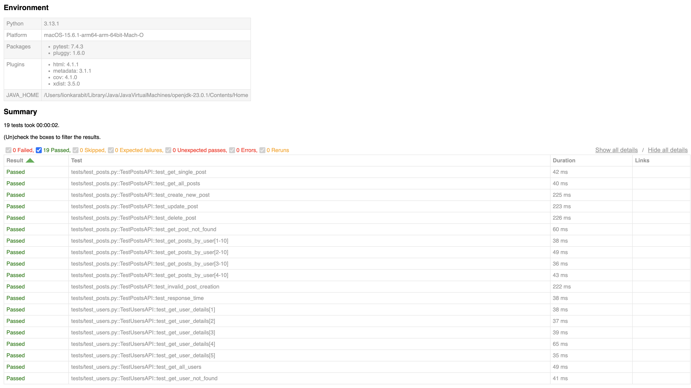
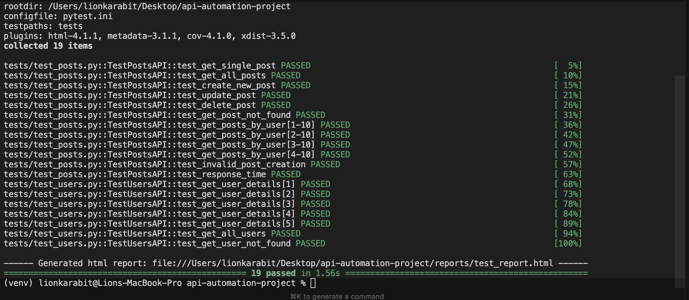

# API Automation Testing Project - JSONPlaceholder

## Overview
This project contains automated API tests for the JSONPlaceholder API (https://jsonplaceholder.typicode.com/), a free fake REST API for testing and prototyping.

## Test Results ✅

**Status**: All 19 tests passing in ~1.5 seconds

### HTML Test Report


*Comprehensive HTML report showing test environment, execution summary, and detailed results for all 19 test cases*

### Terminal Output


*Command-line execution showing all tests passing with real-time progress indicators*

**Test Summary:**
- ✅ **19/19 tests passed** (100% success rate)
- ⏱️ **Execution time**: ~1.5 seconds
- 📊 **Coverage**: Posts API (12 tests) + Users API (7 tests)
- 🎯 **Test Types**: Positive, Negative, Parametrized, Performance

## API Selection
**JSONPlaceholder** - https://jsonplaceholder.typicode.com/
- **Why Selected**: Free, reliable, no authentication required, well-documented, designed specifically for testing
- **Endpoints Tested**: /posts, /users, /comments

## Test Cases

| Test Case ID | Test Name | Endpoint | Method | Description | Expected Result | Validations Used |
|--------------|-----------|----------|--------|-------------|-----------------|------------------|
| TC-001 | test_get_single_post | /posts/{id} | GET | Verify retrieval of a single post by ID | Status 200, valid post data returned | Status code, response schema, data types, specific field values |
| TC-002 | test_get_all_posts | /posts | GET | Verify retrieval of all posts | Status 200, list of 100 posts returned | Status code, response type (list), response count, data structure |
| TC-003 | test_create_new_post | /posts | POST | Verify creation of a new post | Status 201, post created with assigned ID | Status code, response schema, posted data presence, ID assignment |
| TC-004 | test_update_post | /posts/{id} | PUT | Verify updating an existing post | Status 200, post data updated | Status code, updated field values, data persistence |
| TC-005 | test_delete_post | /posts/{id} | DELETE | Verify deletion of a post | Status 200, empty response body | Status code, response body validation |
| TC-006 | test_get_post_not_found | /posts/9999 | GET | Verify handling of non-existent post | Status 404, error handling | Status code, error response validation |
| TC-007 | test_get_posts_by_user | /posts?userId={id} | GET | Verify filtering posts by user ID (parametrized) | Status 200, posts for specific user | Status code, filter validation, userId matching |
| TC-008 | test_get_user_details | /users/{id} | GET | Verify retrieval of user information (parametrized) | Status 200, valid user data | Status code, schema validation, nested object validation |
| TC-009 | test_invalid_post_creation | /posts | POST | Verify validation with invalid data | Status 201 (note: JSONPlaceholder accepts all data) | Status code, response handling |
| TC-010 | test_response_time | /posts | GET | Verify API response time performance | Response time < 2 seconds | Response time validation |

## Validations Used and Rationale

### 1. **Status Code Validation**
- **What**: Verifies HTTP status codes (200, 201, 404, etc.)
- **Why**: Primary indicator of request success/failure. Essential for API contract verification.
- **Implementation**: `assert response.status_code == expected_code`

### 2. **Response Schema Validation**
- **What**: Validates response structure and data types
- **Why**: Ensures API contract compliance and data integrity. Prevents downstream errors from incorrect data types.
- **Implementation**: Type checking for strings, integers, lists, dictionaries
- **Example**: Verifying 'id' is int, 'title' is string, 'userId' is int

### 3. **Data Content Validation**
- **What**: Verifies actual values in response data
- **Why**: Ensures data accuracy and correctness beyond just structure.
- **Implementation**: Direct value comparison for specific fields
- **Example**: Checking if returned userId matches requested userId

### 4. **Response Count Validation**
- **What**: Validates number of items in response arrays
- **Why**: Ensures complete data retrieval and proper filtering.
- **Implementation**: `assert len(response.json()) == expected_count`

### 5. **Response Time Validation**
- **What**: Measures and validates API response time
- **Why**: Ensures performance SLAs are met. Critical for user experience.
- **Implementation**: `assert response.elapsed.total_seconds() < threshold`

### 6. **Nested Object Validation**
- **What**: Validates complex nested data structures (e.g., user.address.geo)
- **Why**: Ensures deep data integrity in complex responses.
- **Implementation**: Accessing and validating nested dictionary keys

### 7. **Filter Parameter Validation**
- **What**: Validates query parameter functionality
- **Why**: Ensures filtering and search capabilities work correctly.
- **Implementation**: Verifying all returned items match filter criteria

### 8. **Empty Response Validation**
- **What**: Validates empty or null responses where expected
- **Why**: Ensures proper handling of DELETE operations and edge cases.
- **Implementation**: Checking response body is empty dictionary

## Project Structure
```
api-automation-project/
├── services/                  # Service layer for API operations
│   ├── __init__.py
│   ├── posts_service.py       # Posts API service (endpoints + methods)
│   └── users_service.py       # Users API service (endpoints + methods)
├── tests/
│   ├── __init__.py
│   ├── test_posts.py          # Tests for posts endpoints
│   ├── test_users.py          # Tests for users endpoints
│   └── conftest.py            # Pytest fixtures and configuration
├── utils/
│   ├── __init__.py
│   └── helpers.py             # Helper functions, validators, and APIClient
├── config/
│   ├── __init__.py
│   └── settings.py            # Configuration settings and endpoints
├── pytest.ini                 # Pytest configuration
├── requirements.txt           # Project dependencies
└── README.md                  # This file
```

### Architecture
This project follows a **Service-Oriented Architecture**:

- **Service Layer** (`services/`): Encapsulates all API interactions
  - Each service class handles a specific API resource (Posts, Users)
  - Contains endpoint definitions and API methods
  - Provides clean, reusable methods for API operations
  
- **Test Layer** (`tests/`): Focuses purely on test logic and assertions
  - Tests use service methods instead of direct API calls
  - Cleaner, more maintainable test code
  - Easy to mock services for unit testing

- **Utilities** (`utils/`): Shared helper functions and base API client
  
- **Configuration** (`config/`): Centralized settings and constants

#### Architecture Flow
```
┌─────────────┐
│   Tests     │  Uses service fixtures
└──────┬──────┘
       │
       ↓
┌─────────────┐
│  Services   │  Handles API operations
└──────┬──────┘
       │
       ↓
┌─────────────┐
│  APIClient  │  Makes HTTP requests
└──────┬──────┘
       │
       ↓
┌─────────────┐
│  API Server │  JSONPlaceholder
└─────────────┘
```

## Service Layer Documentation

### Overview
The service layer provides a clean abstraction for API interactions. Each service class encapsulates all operations for a specific API resource.

### Benefits
1. **Separation of Concerns**: Tests focus on validation logic, services handle API communication
2. **Reusability**: Service methods can be used across multiple tests
3. **Maintainability**: Endpoint changes only need to be updated in one place
4. **Testability**: Easy to mock services for unit testing
5. **Readability**: Clean, semantic method names make tests more understandable

### Available Services

#### PostsService
Located in: `services/posts_service.py`

**Available Methods:**
```python
# Get a single post by ID
response = posts_service.get_post_by_id(post_id=1)

# Get all posts
response = posts_service.get_all_posts()

# Get posts filtered by user ID
response = posts_service.get_posts_by_user(user_id=1)

# Create a new post
post_data = {"title": "New Post", "body": "Content", "userId": 1}
response = posts_service.create_post(post_data)

# Update an existing post
updated_data = {"title": "Updated", "body": "New content", "userId": 1}
response = posts_service.update_post(post_id=1, post_data=updated_data)

# Delete a post
response = posts_service.delete_post(post_id=1)
```

#### UsersService
Located in: `services/users_service.py`

**Available Methods:**
```python
# Get a single user by ID
response = users_service.get_user_by_id(user_id=1)

# Get all users
response = users_service.get_all_users()

# Create a new user
user_data = {"name": "John Doe", "email": "john@example.com", ...}
response = users_service.create_user(user_data)

# Update an existing user
updated_data = {"name": "Jane Doe", "email": "jane@example.com", ...}
response = users_service.update_user(user_id=1, user_data=updated_data)

# Delete a user
response = users_service.delete_user(user_id=1)
```

### Usage in Tests

**Before (Direct API calls):**
```python
def test_get_single_post(self, api_client):
    endpoint = f"{ENDPOINTS['posts']}/1"
    response = api_client.get(endpoint)
    assert response.status_code == 200
```

**After (Using Services):**
```python
def test_get_single_post(self, posts_service):
    response = posts_service.get_post_by_id(1)
    assert response.status_code == 200
```

### How Services Work

1. **Initialization**: Service receives an `APIClient` instance via fixture
2. **Endpoint Management**: Each service stores its base endpoint from `config/settings.py`
3. **Method Calls**: Service methods construct full URLs and make API calls
4. **Response**: Raw `requests.Response` object is returned to the caller for validation

### Adding New Services

To add a new service (e.g., CommentsService):

**1. Create service file** `services/comments_service.py`:
```python
from typing import Dict, Any
import requests
from config.settings import ENDPOINTS

class CommentsService:
    def __init__(self, api_client):
        self.api_client = api_client
        self.endpoint = ENDPOINTS['comments']
    
    def get_comment_by_id(self, comment_id: int) -> requests.Response:
        endpoint = f"{self.endpoint}/{comment_id}"
        return self.api_client.get(endpoint)
    
    # Add more methods as needed...
```

**2. Update** `services/__init__.py`:
```python
from .comments_service import CommentsService

__all__ = ['PostsService', 'UsersService', 'CommentsService']
```

**3. Add fixture in** `tests/conftest.py`:
```python
@pytest.fixture(scope="session")
def comments_service(api_client):
    return CommentsService(api_client)
```

**4. Use in tests:**
```python
def test_get_comment(self, comments_service):
    response = comments_service.get_comment_by_id(1)
    assert response.status_code == 200
```

### Service Best Practices

1. **Keep services focused**: One service per resource type
2. **Return raw responses**: Let tests handle response parsing and validation
3. **Use type hints**: Make method signatures clear and self-documenting
4. **Add docstrings**: Document what each method does
5. **Follow naming conventions**: Use clear, descriptive method names
6. **Handle errors gracefully**: Don't catch exceptions in services, let them bubble up to tests

## Setup Instructions

### Prerequisites
- Python 3.8 or higher
- pip (Python package manager)

### Installation

1. Clone or download this project
2. Navigate to project directory:
   ```bash
   cd api-automation-project
   ```
3. Create and activate virtual environment:
   ```bash
   # Create virtual environment
   python3 -m venv venv
   
   # Activate virtual environment
   # On macOS/Linux:
   source venv/bin/activate
   
   # On Windows:
   venv\Scripts\activate
   ```
4. Install dependencies:
   ```bash
   pip install -r requirements.txt
   ```

### Running Tests

**Note:** If you haven't activated the virtual environment, use `./venv/bin/pytest` instead of `pytest` in the commands below.

#### Run all tests:
```bash
pytest tests/ -v
# or without activating venv:
./venv/bin/pytest tests/ -v
```

#### Run by test markers:
```bash
# Run smoke tests only
pytest -m smoke -v

# Run positive tests only
pytest -m positive -v

# Run negative tests only
pytest -m negative -v

# Run performance tests only
pytest -m performance -v
```

#### Run specific test file:
```bash
pytest tests/test_posts.py -v
```

#### Run specific test:
```bash
pytest tests/test_posts.py::TestPostsAPI::test_get_single_post -v
```

#### Run with coverage report:
```bash
pytest tests/ --cov=tests --cov-report=html --cov-report=term
# Open htmlcov/index.html to view detailed coverage report
```

#### Run tests in parallel (faster execution):
```bash
pytest tests/ -n auto -v
```

#### Generate HTML test report:
```bash
pytest tests/ --html=reports/test_report.html --self-contained-html
```

#### Run with detailed output:
```bash
pytest tests/ -v -s
```

## Test Results

Tests include:
- ✅ Positive test cases (happy path)
- ✅ Negative test cases (error handling)
- ✅ Parametrized tests (multiple data sets)
- ✅ Response time validation
- ✅ Schema validation
- ✅ Data integrity validation

## Technologies Used
- **Python 3.8+**: Programming language
- **pytest**: Testing framework
- **requests**: HTTP library for API calls
- **pytest-html**: HTML report generation
- **pytest-xdist**: Parallel test execution

## Best Practices Implemented
1. **Service-Oriented Architecture**: API calls abstracted into service classes
2. **Separation of Concerns**: Services, tests, utilities, and config separated
3. **Parametrization**: Used `@pytest.mark.parametrize` to reduce code duplication
4. **Fixtures**: Centralized configuration and reusable components
5. **Clear Assertions**: Descriptive assertion messages with context
6. **Comprehensive Validation**: Multiple validation layers per test
7. **Performance Testing**: Response time validation included
8. **Negative Testing**: Error scenarios covered
9. **DRY Principle**: Reusable service methods eliminate code duplication
10. **Maintainability**: Easy to extend with new endpoints/services

## API Documentation
JSONPlaceholder API: https://jsonplaceholder.typicode.com/

